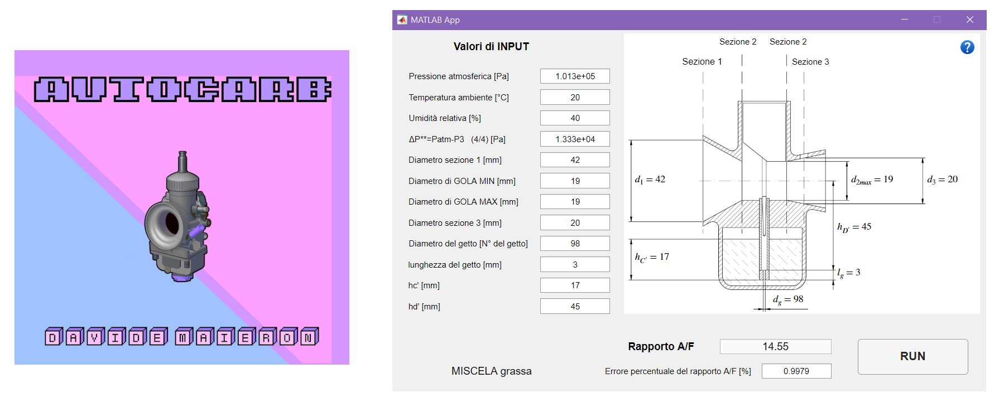

# AutoCARB

Quest'applicazione verifica la carburazione mediante un modello analitico, il quale prende in considerazione le seguenti ipotesi:
1. Si trascurano gli effetti dinamici, assumendo il flusso d'aria e il flusso di benzina stazionari.
    Gli effetti dinamici sono dati dalla periodica aspirazione di carica fresca operata da ogni
    cilindro, il flusso può essere instazionario anche in condizioni di regime e carico costanti.
2. Con la nuova versione del software l'ipotesi fluido incomprimibile viene utilizzata solo per la benzina, l'aria invece la si considera come un gas perfetto.
3. Si trascurano le perdite di carico e gli scambi di calore con le pareti fino alla sezione di ingresso del convergente.
4. Si considera `Cc<Cd`, le quali sono la velocità in ingresso e la velocità in uscita dal getto del massimo.

Il modello matematico si basa principalmente sulla teoria degli ugelli, nella quale si considera l'aria come un gas perfetto soggetto a trasformazioni adiabatiche.
La stima del calore specifico dell'aria a pressione costante avviene tramite le "tabelle di Janaf".

La benzina invece, viene considerata come un fluido incomprimibile, tale ipotesi seppur sia un'approssimazione, è coerente con la natura fisica del fluido in esame.   
 
Per quanto riguarda le perdite distribuite il programma riesce a calcolare il fattore di attrito, simulando in maniera quasi perfetta il diagramma di Moody.

Infine si considerano le perdite di carico (distribuite e concentrate) calcolando il coefficiente di efflusso, il quale in aggiunta ci fornisce il contributo dato dalla contrazione della vena fluida. 
Per approfondire l'equazione del coefficiente di efflusso della benzina che ho utilizzato nel modello, leggete l'articolo pubblicato su [Matematicamente](https://www.matematicamente.it/forum/viewtopic.php?f=38&t=211382).
Mentre per quanto riguarda il coefficiente utilizzato per l'aria, faccio riferimento al modello per fluidi comprimibili e di moto sub critico descritto e dimostrato nell'[articolo](https://journals.sagepub.com/doi/10.1243/JMES_JOUR_1960_002_007_02) del professor S.L.Bragg dell’università di Pittsburgh.

## Installazione

Andando alla [pagina di **Download**](https://github.com/dogengineer/AutoCARB/releases/) è possibile scegliere tali versioni del programma.

### 1. **AutoCARB_NUM_win_installer.zip**
Questa versione scarica e installa tutto il software necessario (Matlab) sul vostro computer e rende l'applicazione disponibile e funzionante. Questa è la versione consigliata per gli utenti meno esperti.

### 2. **AutoCARB_NUM_win.zip**
Questa è una versione _lightweight_ del programma, che richiede come prerequisito l'installazione del [**runtime Matlab R2020b**](https://it.mathworks.com/products/compiler/matlab-runtime.html). Consigliata ad utenti più esperti.

### 3. **AutoCARB_NUM_linux_installer.zip** 
Per installare questa versione, occore avere una buona dimestichezza con linux, perché dovete effettuare qualche modifica e avviarla dal terminale. 

### 4. **AutoCARB_NUM_linux.zip**
Le operazioni di installazione sono del tutto simili a quelle della versione per Windows, tranne che dal medesimo link dovrete installare i runtime per linux.

## Manuale di Utilizzo

Il manuale di istruzioni per una perfetta carburazione, è disponibile a [questo indirizzo](https://github.com/dogengineer/AutoCARB/blob/main/Manuale_di_AutoCARB.pdf).

## Contributors

[Ing. Davide Maieron](https://www.linkedin.com/in/davide-maieron-3757851bb/) lead programmer and engineer

[Ing. Adriano Mazzola](https://www.linkedin.com/in/adriano-mazzola/) engineering consultant 

[Roberta Carlevaris](https://www.instagram.com/robzilla.tattoo/) chief artist and designer

[antipatico](https://github.com/antipatico) git wizard and computer master

## Licenza

Il programma è rilasciato sotto licenza [GPLv3](LICENSE).
